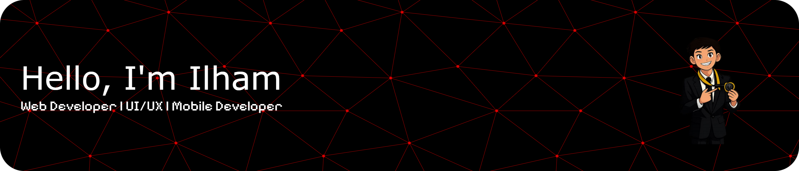

<!--
**FloooXty/FloooXty** is a ✨ _special_ ✨ repository because its `README.md` (this file) appears on your GitHub profile.

Here are some ideas to get you started:

- 🔭 I’m currently working on ...
- 🌱 I’m currently learning ...
- 👯 I’m looking to collaborate on ...
- 🤔 I’m looking for help with ...
- 💬 Ask me about ...
- 📫 How to reach me: ...
- 😄 Pronouns: ...
- ⚡ Fun fact: ...
-->

###

###

<h4 align="left">I'm Ilham  I am a Junior Developer currently pursuing my studies at a university. I have a strong interest in Web Development, UI/UX Design, and Mobile Development, and I am continuously working to improve my skills in the tech field.  I am highly motivated to learn more about application development and user experience, from creating visually appealing interfaces to building functional and efficient systems. For me, technology is not just about writing code, but also about delivering meaningful and user-centered solutions.  🚀 I am currently focusing on strengthening my skills in web development, UI/UX design, and mobile app development, and I am open to learning new technologies and collaborating on exciting projects.</h4>

###

<h1 align="left">I code with</h1>

###

  
  
  
  
  
  
  
  
  
  
  
  
  
  
  

###

<h2 align="left">Let's Play With Me</h2>

###

<picture>
  <source media="(prefers-color-scheme: dark)" srcset="https://raw.githubusercontent.com/FloooXty/FloooXty/output/pacman-contribution-graph-dark.svg">
  <source media="(prefers-color-scheme: light)" srcset="https://raw.githubusercontent.com/FloooXty/FloooXty/output/pacman-contribution-graph.svg">
  
</picture>

###